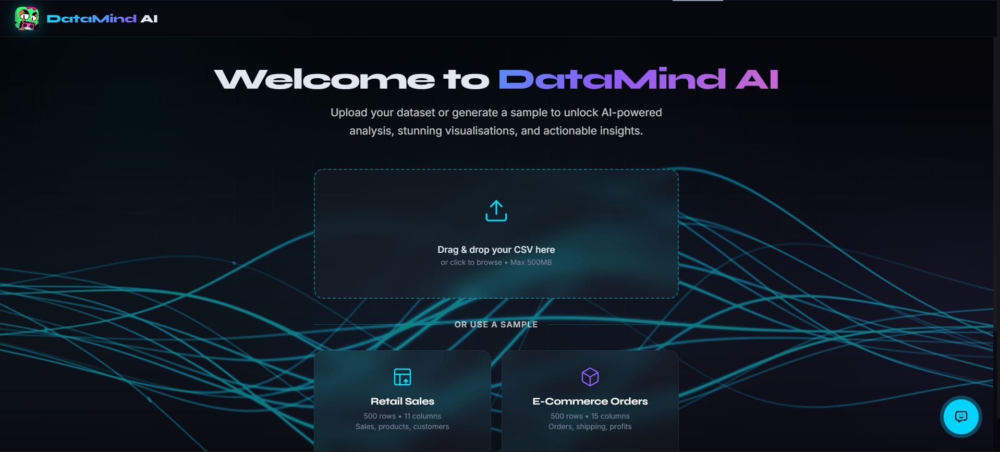
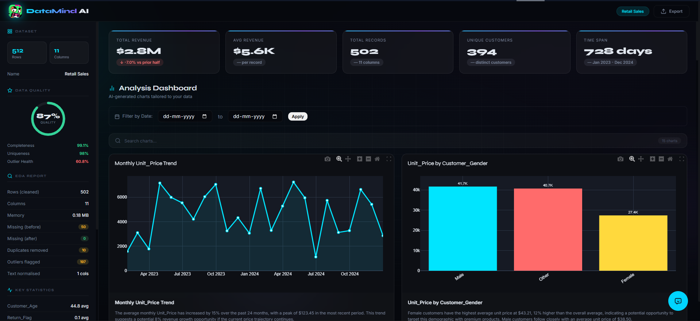
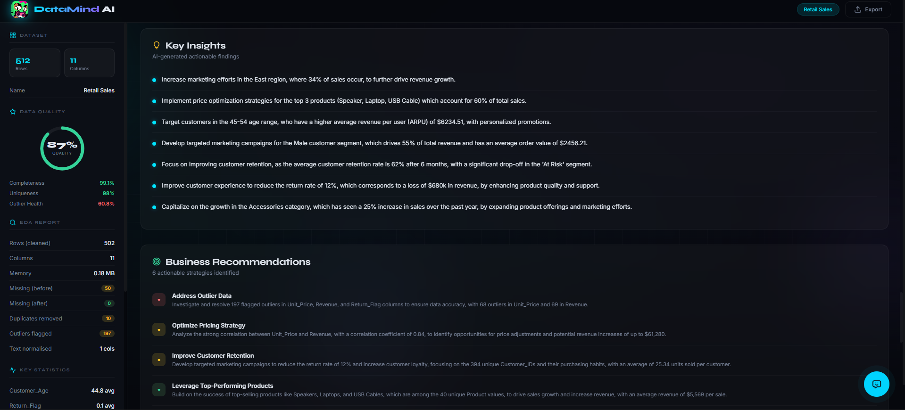
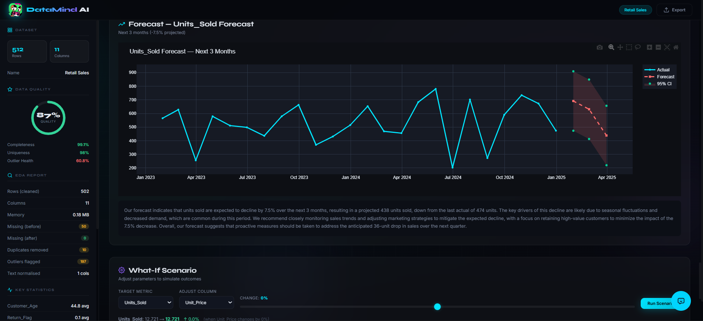
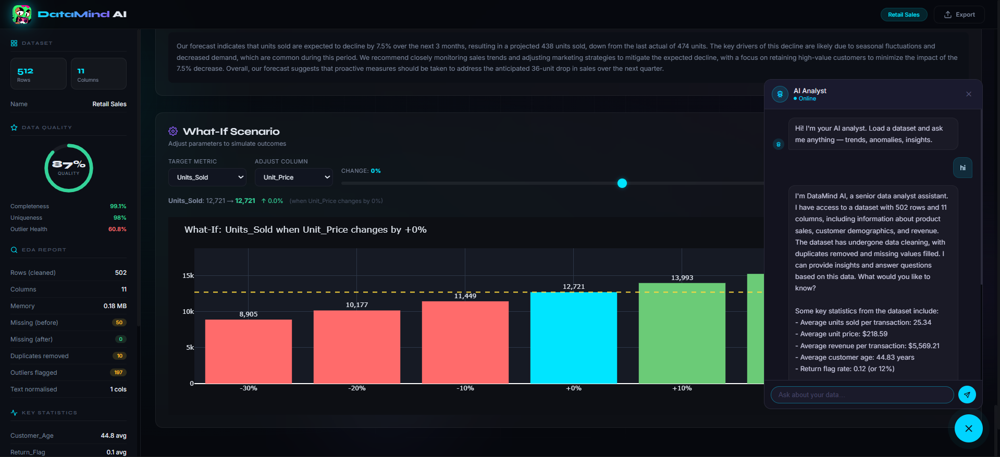

# 🧠 DataMind AI - Intelligent Data Analyst

> AI-powered data analysis dashboard - upload any CSV and get instant EDA,
> 20+ interactive charts, forecasting, and natural language AI insights.

🚀 **Live Demo:** https://huggingface.co/spaces/samuelalex37/DataMind-AI

## 👤 Author
**Samuel Alex** - [LinkedIn](https://linkedin.com/in/samuel-alex-47496a289) · [GitHub](https://github.com/samuelalex3737)
```







---

## ✨ Features
- **CSV Upload** - Drag-and-drop any CSV file (up to 500MB)
- **Sample Datasets** - Pre-built Retail Sales and E-Commerce datasets
- **Automated EDA** - Missing values, duplicates, outliers, correlations
- **20+ Chart Types** - Line, bar, pie, heatmap, waterfall, radar, BCG, RFM, and more
- **AI Chat Analyst** - Ask questions about your data in natural language
- **Forecasting** - Time series forecasting with confidence intervals
- **Key Insights** - AI-generated actionable business insights
- **What-If Analysis** - Scenario simulation with adjustable parameters

## 🛠️ Tech Stack
- **Backend**: Python, Flask
- **Frontend**: HTML, CSS, JavaScript (single-page app)
- **AI**: Groq API (LLaMA 3.3 70B)
- **Charts**: Plotly
- **ML**: scikit-learn (KMeans), mlxtend (Apriori)
- **Forecasting**: statsmodels (Exponential Smoothing)

## 🚀 Quick Start

### 1. Clone & Install
```bash
git clone https://github.com/samuelalex3737/DataMind-AI
cd DataMind-AI
pip install -r requirements.txt
```

### 2. Set Your Groq API Key
```bash
# Mac/Linux
export GROQ_API_KEY="your_groq_api_key_here"

# Windows (PowerShell)
$env:GROQ_API_KEY = "your_groq_api_key_here"
```

### 3. Run
```bash
python app.py
```
Navigate to **http://localhost:5000**

## 📁 Project Structure
```
├── app.py              # Flask backend & API routes
├── datasets.py         # Sample dataset generators
├── eda.py              # EDA pipeline
├── charts.py           # Chart orchestrator
├── charts_core.py      # Core chart functions (12 types)
├── charts_advanced.py  # Advanced chart functions (11 types)
├── ai_analyst.py       # Groq API integration
├── templates/
│   └── index.html      # Frontend SPA
└── requirements.txt
```

